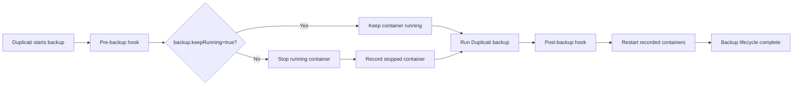

# duplicati-with-docker

`duplicati-with-docker` is a small, unofficial extension of the official
[Duplicati Docker image](https://hub.docker.com/r/duplicati/duplicati). It is
**not a fork of Duplicati**: Duplicati is neither rebuilt nor repackaged here.

This image adds only:

- the Docker CLI, installed through the upstream image's package manager;
- a pre-backup hook that stops running containers;
- a post-backup hook that restarts only the containers stopped by that hook;
- the `backup.keepRunning=true` label for opting containers out of shutdown.

The base image uses an explicitly pinned upstream `*-stable` version. Renovate
proposes stable-version updates as pull requests so that CI and a maintainer can
review them before publishing.

## Backup lifecycle



The pre-backup script examines all containers currently running on the Docker
daemon available through `/var/run/docker.sock`. It leaves containers labeled
`backup.keepRunning=true` running and stops the others. Each container ID is
recorded only after `docker stop` succeeds.

The IDs are stored in:

```text
/var/tmp/duplicati_stopped_containers.txt
```

The post-backup script starts only those recorded IDs, so containers that were
already stopped stay stopped. It removes the state file after every recorded
container has been started successfully. If pre-backup shutdown fails, the hook
attempts to restart everything it stopped and removes the state file when that
rollback succeeds. Failed rollback or post-backup restart operations retain the
state file for manual recovery. A stale state file prevents a new pre-backup run
from overwriting recovery information.

The derived Duplicati image itself carries `backup.keepRunning=true`, preventing
the hook from stopping its own container.

## Duplicati job settings

Add these advanced options to each backup job that should use the lifecycle
hooks:

```text
--run-script-before-required=/hooks/stop_containers.sh
--run-script-after=/hooks/start_containers.sh
--run-script-timeout=600s
```

The required pre-backup script prevents the backup from continuing when the
container shutdown cannot be completed.

## Docker Compose example

Replace `YOUR_DOCKERHUB_USERNAME` and the host backup paths as appropriate.

```yaml
services:
  duplicati:
    image: YOUR_DOCKERHUB_USERNAME/duplicati-with-docker:stable
    container_name: duplicati
    restart: unless-stopped
    ports:
      - "8200:8200"
    volumes:
      - duplicati-data:/data
      - /var/run/docker.sock:/var/run/docker.sock
      - /srv:/source:ro
      - /mnt/backups:/backups

volumes:
  duplicati-data:
```

Add the opt-out label to any service that must remain available during backup:

```yaml
services:
  database:
    labels:
      backup.keepRunning: "true"
```

> [!WARNING]
> Mounting `/var/run/docker.sock` gives the container extensive, effectively
> root-equivalent control over the Docker host. Anyone who can execute code in
> the container or control its Duplicati scripts may be able to control other
> containers, mount host paths, and compromise the host. Use this image only on
> a trusted system and restrict access to Duplicati.

If Duplicati's `UID`/`GID` options are used, the resulting runtime user must
also have permission to access the mounted Docker socket. Otherwise Docker CLI
commands can fail with `permission denied` even though the CLI is installed.

## Building and testing

```sh
docker build --tag duplicati-with-docker:test .
IMAGE=duplicati-with-docker:test ./tests/test-hooks.sh
```

The integration test requires a clean Docker daemon, such as a fresh CI runner.
It checks for existing running containers before creating anything and aborts
without modifying them if any are found. The test verifies normal lifecycle and
rollback behavior using real Docker containers. Test containers are removed
even when a check fails.

Pull requests targeting `main` and pushes to `main` validate the pinned stable
version, run ShellCheck, build the native image, verify its Docker CLI, and run
the integration test. The publishing workflow reuses the same test workflow and
publishes only after it succeeds. Pushes to `main` publish multi-platform
`linux/amd64`, `linux/arm64`, and `linux/arm/v7` images tagged `stable`, `latest`,
the pinned Duplicati version, and `sha-<commit>`.

Configure `DOCKERHUB_USERNAME` as a GitHub Actions repository variable and
`DOCKERHUB_TOKEN` as a repository secret. Deployment is intentionally outside
this repository; in the intended setup, Komodo handles deployment and updates.

## Upstream and project status

This project is unofficial and is not affiliated with, endorsed by, or
maintained by the Duplicati project. Duplicati remains separately licensed by
its upstream project. The MIT license in this repository covers only this
project's own additions.

## AI assistance disclosure

Generative AI tools were used to assist in creating parts of the source code,
documentation, tests, and project configuration in this repository.

AI-generated output was reviewed, adapted where necessary, and tested by humans
before being incorporated into the project.

Generative AI was used as a development assistance tool only. Responsibility
for the contents, behavior, security, and published releases of this repository
remains with the project maintainer.
